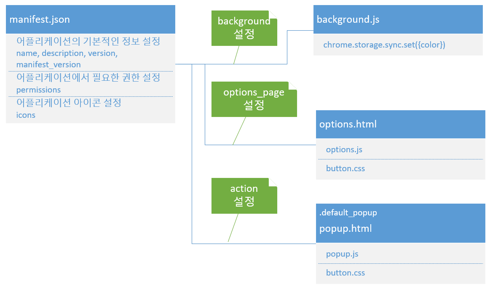

# 크롬 확장 프로그램 만들기

## getting started 분석

chrome 확장 프로그램은 기본적으로 manifest에 빌드 버전, 필요한 권한 등 기본적인 명세를 기록한다. 정보 표기 이외에도 팝업을 사용하거나 권한 설정 등 작동 방식에 영향을 끼치는 것들이 있으니 중요하게 보아야 한다.

<pre>
<code>
{
	// extension의 기본적인 정보이다.

	"name": "Getting Started Example",
	"description": "Build an Extension!",
	"version": "1.0",
	"manifest_version": 3,

	// 해당 확장 프로그램이 요구할 권한

	"permissions": ["storage", "activeTab", "scripting"],

	// 크롬 상단 툴바에 나타낼 아이콘

	"icons": {
		"16": "/images/get_started16.png",
		"32": "/images/get_started32.png",
		"48": "/images/get_started48.png",
		"128": "/images/get_started128.png"
	},

	// 백그라운드 서비스 등록

	"background": {
		"service_worker": "background.js"
	},

	// 아이콘을 누를때 띄울 팝업

	"action": {
		"default_popup": "popup.html",

		// 아이콘의 이미지

		"default_icon": {
			"16": "/images/get_started16.png",
			"32": "/images/get_started32.png",
			"48": "/images/get_started48.png",
			"128": "/images/get_started128.png"
		}
	},

	// 확장 프로그램 설정시의 페이지

	"options_page": "options.html"
}

</code>
</pre>

_기본 구성도_

manifest.json 파일은 기본적으로 어플리케이션의 기본 정보를 저장한다.

manifest.json에서 기본 정보를 제외한 기능적으로는, 크게 5가지를 정의한다.

1. 퍼미션 (permissions)
2. 아이콘 (icons)
3. 백그라운드 서비스 (background.service_worker)
4. 팝업 (action.default_popup)
5. 옵션 페이지 (options_page)

### 퍼미션

[구글 확장 프로그램 퍼미션](https://developer.chrome.com/docs/extensions/mv3/declare_permissions/)

퍼미션은 다양한 종류가 있지만 현재 나타나 있는 것들은 대략 이정도이다.

<table>
	<tr>
		<td>storage</td>
		<td>chrome.storage API의 접근 권한</td>
	</tr>
	<tr>
		<td>activeTab</td>
		<td>현재 활성화된 탭에 접근할 수 있는 권한</td>
	</tr>
	<tr>
		<td>scripting</td>
		<td>chrome.scripting API의 접근 권한</td>
	</tr>
</table>

### 백그라운드 서비스

백그라운드 서비스는 기본적으로 어플리케이션이 등록될때 실행된다. 각종 이벤트를 등록하여 사용할 수 있다.

### 팝업

크롬 툴바에서 아이콘을 누를 때 보여질 팝업 창이다. 페이지 이동 없이 크롬 우측 상단에 팝업 형태로 보여진다.

### 옵션 페이지

크롬 툴바에서 아이콘을 우클릭한 후 옵션 페이지를 선택했을때 새 탭에서 보여지는 페이지 이다.